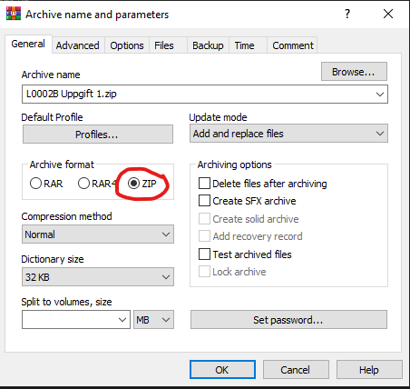

# Klasser, Listor, Sortering och Filer
I denna uppgift kommer ni behöva använda klasser, listor, sorterings algoritmer och sedan skriva filer.

Detta får vara gjort som en Console Application eller Windows Forms Application. <br>
 <br>
 <br>

## Uppgiften
Ni ska skriva en applikation som tar in "Namn", "Personnummer", "Distrikt" och "Antal sålda artiklar" och lägga in det i en lista, sedan ska ni skriva ut listan till en fil.

`Säljare` har informationen som anges `(namn, personnummer, distrikt samt antal)`

När ni skriver ut så ska ni tänka på att det finns fyra nivåer för säljarna, `under 50 artiklar`, `50-99 artiklar`, `100-199 artiklar`, `över 199 artiklar`

Sortera eran lista av `Säljare` baserat på `Antal sålda artiklar` och sedan skriv ut det som exemplet nedan:
```
Namn        Persnr      Distrikt        Antal
Kalle Anka  4503038990  Piteå           173
1 säljare har nått nivå 3: 100-199 artiklar

Musse Pigg  3502038964  Boden           202
Snobben     7805055673  Luleå           203
2 säljare har nått nivå 4: över 199 artikla
```
Osv...
## Några bra tipps
- Utnyttja er av standard libraries, Linq är bra för listor
```cs
List<int> nummer = new List<int>() {
    5,
    0,
    69,
    74,
    35,
    86
};

nummer.Sort((första, andra) => första.CompareTo(andra));
/*
Listan är nu istället sorterad såhär:
0,
5,
35,
69,
74,
86
*/
```
- Man kan överskriva grunfunktioner på sina klasser
```cs
class MinKlass {
    public int värde;

    public override string ToString() {
        return "Värdet är " + värde;
    }
}

MinKlass mitt_object = new MinKlass() {
    värde = 69
};

// Skriver då ut "Värdet är 69"
Console.WriteLine(mitt_object.ToString());
```
- Utnytja rätt loop för arbetet
```cs
// Göra arbeten på en range av nummer
for (int i = 0; i < 50; i++) {
    Console.WriteLine(i);
}

// Iterera över en lista
List<int> nummer_lista = new List<int>() {
    5,
    0,
    69,
    74,
    35,
    86
};
foreach (int nummer in nummer_lista) {
    Console.WriteLine(nummer);
}

// Arbeta tills en kondition har uppnåtts
int nummer = 0;
while (nummer == 0) {
    Console.WriteLine("Skriv ett nummer");
    string input = Console.ReadLine()
    try {
        nummer = int.Parse(input);
    }
    catch (FormatException) {
        Console.WriteLine("Det var inte ett nummer, försök igen");
    }
}
Console.WriteLine("Ditt nummmer är " + nummer);
```
- När ni ska skriva till en fil, så behöver ni inte skriva hela filvägen
```cs
// Detta är en relativ path, då kommer den ta det nuvarande mappen, och försöka att skriva en fil i mappen med namnet "fil.txt"
File.WriteAllText("fil.txt", "Hejsan från C#!");
```

## Inlämmning
Ni ska ta och zippa ihop erat projekt

För att göra det genom WinRar så välj filerna du vill zippa upp, och sedan följ dessa bilder: <br>
 <br>
Sedan <br>
 <br>