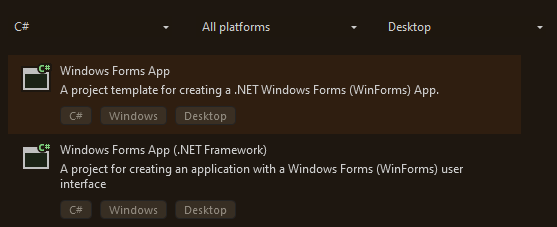
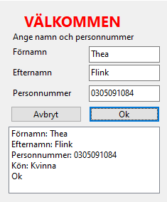

# Class methods and Data validation
In this assignment you will be using a class, and some methods on the class to handle/validate the data that has been put in.

For this assignment you will only use Windows Forms: <br>
 <br>

## What you will need to do
You will create a application that takes in 3 values, and then validates the information, the values are "First name", "Last name" and "Social security number"

All information `must` be stored in a class.

You will then run a check on the Social security number by either using the 21-algoritm or controllnumber.

Afterwards you will use the Social security number to check if the user is a man, or a woman.

Your application should look a little bit like this: <br>
  <br>

But be creative! Make it look nice!

## Some helpfull tips
- A class variable can have a getter and a setter, and they can be defined like a function instead
```cs
class MyClass {
    private string Text;
    // Take the first character out of Text
    public char? FirstCharacter {
        // This is a getter
        get {
            if (string.IsNullOrEmpty(Text)) {
                return null;
            }
            return Text[0];
        }
        // This is a setter
        set {
            if (string.IsNullOrEmpty(Text)) {
                return;
            }
            Text[0] = value;
        }
        // You do not have to define a setter, only a getter if you want to use this system
    }
}
```
- To verify the length of a string is easy
```cs
string MyText = "Hello!";

// Om längden av MinText är längre eller lika med 5 så skriver vi Tjenare!
if (MyText.Length >= 5) {
    Console.WriteLine("Hi!");
}
```
- You can loop over a string.
```cs
string MyText = "Hello!";

foreach (char c in MyText) {
    Console.WriteLine(c);
}
```

## Turning in your assignment
You will need to zip up the whole project into a zip archive

For winrar you can follow these steps: <br>
 <br>
Then <br>
 <br>